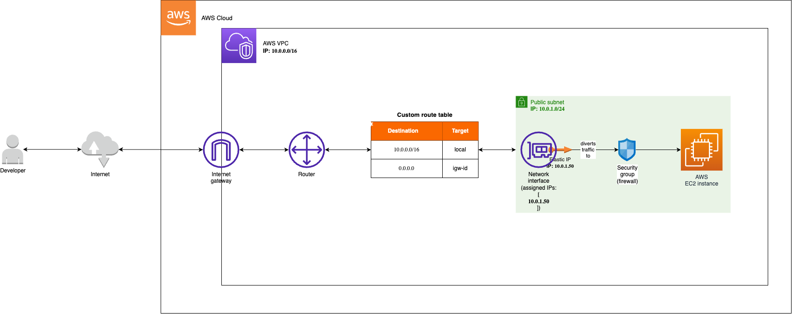

# About
A terraform file that creates a VPC and initialises a subnet in it.



# Installation
The build has been tested with Terraform v1.4.5.

Steps:
1. Install Terraform
2. Expose your AWS "access key id" and "secret access key" to the current terminal session with:
```
export AWS_ACCESS_KEY_ID=yourAccessKeyId
export AWS_SECRET_ACCESS_KEY=yourSecretAccessKey
```
3. Initialise Terraform with:
```
terraform init
```
4. Preview the changes that Terraform plans to make to your infrastructure with:
```
terraform plan
```
5. Apply the changes with:
```
terraform apply
```
6. Create a `.pem` key with the name "main-key" in the created EC2 instance.
7. SSH to the server
```
ssh -i "main-key.pem" ubuntu@private.ip
```
8. Destory instances with:
```
terraform destroy
```
