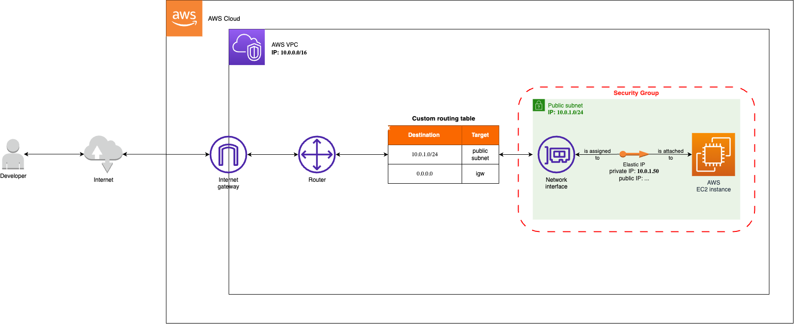

# About
A terraform file that creates a VPC and initialises a public subnet in it.



# Installation
The build has been tested with **Terraform v1.4.5**.

Steps:
1. Install Terraform
2. Expose your AWS "access key id" and "secret access key" to the current terminal session with:
```
export AWS_ACCESS_KEY_ID=yourAccessKeyId
export AWS_SECRET_ACCESS_KEY=yourSecretAccessKey
```
3. Initialise Terraform with:
```
terraform init
```
4. Preview the changes that Terraform plans to make to your infrastructure with:
```
terraform plan
```
5. Apply the changes with:
```
terraform apply
```
6. Create a `.pem` key with the name `main-key` using the **AWS Management Console > EC2 > Network & Security > Key Pairs**. This key name is associated in the Terraform file while initialising the EC2 instance.
7. SSH to the server
```
ssh -i "main-key.pem" ubuntu@public.ip.goes.here
```
8. Destory the AWS infrastructure with:
```
terraform destroy
```

# Notes
1. [What is **Internet Gateway**?](https://docs.aws.amazon.com/vpc/latest/userguide/VPC_Internet_Gateway.html)
2. [Why did we define a **custom routing table**?](https://docs.aws.amazon.com/vpc/latest/userguide/VPC_Route_Tables.html)
3. [Why do we use **elastic IPs**?](https://stackoverflow.com/a/50306357/12959962) 